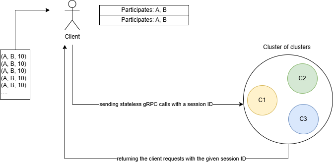
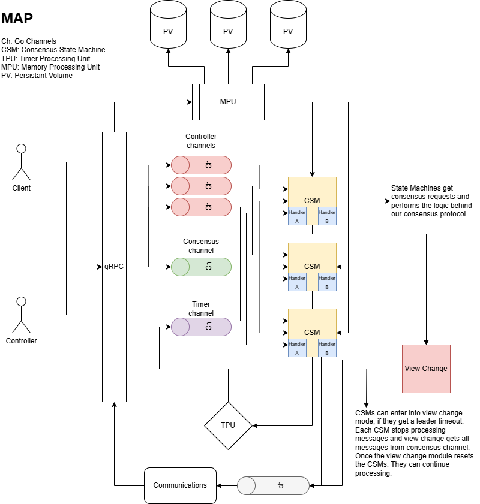

# 2PC

The objective of this project was to implement a fault-tolerant distributed transaction processing system that supports a simple banking application. To do this, we partition servers into multiple clusters where each cluster maintains a data shard. Each data shard is replicated on all servers of a cluster to provide fault tolerance. The system supports two types of transactions: intra-shard and cross-shard.

An intra-shard transaction accesses the data items of the same shard while a cross-shard transaction
accesses the data items on multiple shards. To process intra-shard transactions the `multi paxos` protocol is used while the `two-phase commit` protocol is used to process cross-shard transactions.

## Cluster

The project `cluster` is a program that runs the system `nodes`. In order to set up a cluster, we need to create a `config.yaml` file like this:

```yaml
subnet: 6001 # nodes ports will start from this subnet and increament
replicas: 3 # the number of cluster replicas
replicas_starting_index: 1 # replica name prefix
cluster_name: "C1" # the cluster name
log_level: "debug" # log level
mongodb: "mongodb://localhost:27017/" # mongo db address
database: "global" # global db to load the hards
paxos: # paxos consensus parameters
  state_machine_replicas: 1
  state_machine_queue_size: 10
  majority: 1
  leader_timeout: 3 # in seconds
  leader_ping_interval: 1 # in seconds (must be less than timeout)
  consensus_timeout: 100 # in milliseconds
```

Then you can start the cluster by running `./main ../configs/C1.yaml ../configs/hosts.ini`. The file `hosts.ini` holds the data for nodes and their addresses. Make sure to modify it:

```ini
S1-localhost:6001
S2-localhost:6002
S3-localhost:6003
S4-localhost:7001
S5-localhost:7002
S6-localhost:7003
S7-localhost:8001
S8-localhost:8002
S9-localhost:8003
client-localhost:5001
C1-S1
C2-S4
C3-S7
EC1-S1:S2:S3
EC2-S4:S5:S6
EC3-S7:S8:S9
all-S1:S2:S3:S4:S5:S6:S7:S8:S9
```

The cluster needs input shards. To build our shards, we need to use `cli` to manage shards and perform shards rebalance.

```sh
# running ./main shard <path-to-inputs> <path-to-shards> <mongo-db-uri> global
./main shard ../tests/shards.csv $(cat ../configs/local.txt) global

# running ./main rebalance <transactions-count> <mongo-db-uri> global
./main rebalance 1 $(cat ../configs/local.txt) global
```

### Load shard data

Shards input file is a CSV like this:

```csv
Shard, Cluster, Range
D1, C1, 1-1000
```

The ouput will be stored inside `MongoDB` cluster like this in `global` database:

```json
{
    "client": "S1",
    "cluster": "C1",
    "shard": "D1"
}
```

They are accessable inside `shards` collection in a MongoDB cluster.

## Client

The client has a `gRPC` server to receive outputs. Therefore, you have to run it by entring:

```sh
# running ./main <ip-tables> <mongo-uri> <database> <grpc-port> <test-case-path>
./main ../configs/hosts.ini $(cat ../configs/local.txt) global 5001 ../tests/tests.csv
```

### PrintBalance

Accept a client, find the cluster, send a request to get the client balance.

### Performance

Calculate the system's performance when sending a request.

### PrintLogs

Accept a target and prints its logs.

### PrintDatastore

Accept a target and prints its committed transactions.

### PrintDatastores

Loops over all servers and calls print datastore.

### 2PC

In order to process a transaction, the client reads transactions from a `csv` file. For each transaction, the client triggers an inter-shard or cross-shard procedure based on the clusters that are needed in processing the transaction.

1. The client sends `prepare` to all participates.
2. The client receives `ack` from all participates.
3. The client sends `commit` or `abort` based on the `ack` values.

For concurrent transaction handling, the client assigns a `sessionId` which will be used for each transaction.

## Cluster

When a cluster is running, it clones its data from the `global` database. For each of its nodes, it runs a new process manager. A process manager starts a node, and waits for input commands from the cluster manager. For each node, there is collection in the cluster's database.

The cluster manager looks a collection called `events` in the database. In an interval, it get's all events that are belong to it from that collection and performs a logic (`scale-up`, `scale-down`, `reshard`). After that, it will mark that event as done.

### Node

Each node has a `gRPC` interface that accepts `RPC` calls from both client and other nodes. A list of these `RPC` calls are as follow.

- `PrintBalance` : accepts a client name and returns its balance.
- `PrintLogs` : returns all write-ahead logs inside this node.
- `PrintDatastore` : returns all committed transactions inside this node.

### 2PL

Each server has a local lock for input transactions. If a lock is being set, then the input transaction will be aborted. Otherwise, the server accepts the input transaction. The lock table is a key-value map that tells wheter a record is being used by the processor or not.

### WAL

For each operation, the server logs the operations in the following manner.

```
<T1, Start>
<T1, Update, Record, New>
<T1, Commit/Abort>
```

### Paxos

Each server has the following RPCs to perform `multi-paxos` when receiving `request` and `prepare` messages.

- `ping` : the leader calls this every `N` seconds. if a follower does not get `ping`s from the leader, it will send `ping` itself until one leader is selected. In the `ping-pong` process, leader and followers update themselves to sync each other.
- `pong` : the followers return the ping answer for any sync process.
- `sync` : the caller tries to sync the callee.
- `accept` : the leader calls accept on every cluster node to update their accepted num and accepted val.
- `commit` : the leader calls commit on getting `f+1` accepted messages.

#### Ping-Pong & Sync

On `ping` operation, leaders sends its last accepted ballot-number and it's id to all nodes. The nodes get this message and call `pong` if the server is left behind. Otherwise, they update themselves.

If the leader does not send `ping`s after a while. All follower nodes start `ping` others and the node with higher id will become the new leader.

When a node gets `ping`, if the leader is not synced, it calls the leader `sync` RPC. On the other hand, if a node is not synced with the leader, it calls `pong` RPC so the leader calls `sync` on that node.

#### Accept

When getting a request, the node will call `accept` on all nodes. If it is not the leader, it will call the procedure on the leader node. Other nodes update their status and logs to follow the leader.

#### Commit

When the leader gets `f+1` accepted messages, it will send `commit` message and execute the request.

### Shards Rebalance

In order to rebalance the shards, first use `cli` to find the suggested accounts to be replaced inside the shards. Its output is a `new-schema.txt` like this:

```
{clusters: [C1 C2], accounts: [1997, 796], transactions: 2, total: 16.000000}
{clusters: [C1 C3], accounts: [11, 2001], transactions: 2, total: 12.000000}
```

Then in the client, run `rebalance` command and pass this file in order to rebalance the shards.

## Schema

In here you can see the system diagrams that are used inside and outside the clusters.



---


